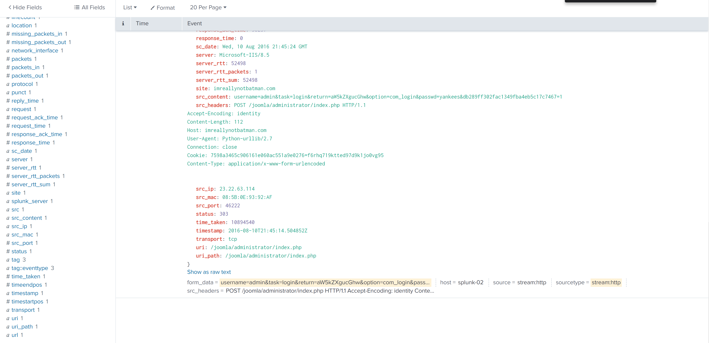

# Splunk BOTS v1 Recap

## Q1: What is the likely IPv4 address of someone from the Po1s0n1vy group scanning imreallynotbatman.com for web application vulnerabilities?

First, we need to identify the IP address that belongs to our web server, which is likely what the threat group is scanning. We can run the below SPL query with the pipe command to return the destination IP address (`dest_ip`) with the highest hits, which is likely indicative of a web server.

```
index="botsv1" sourcetype="stream:http"
| top dest_ip
```

After running this SPL query, we see that the IP address with the most hits is `192.168.250.70`.


We can double check and confirm that this is in fact the IP address that belongs to `imreallynotbatman.com` by adding the IP address into the query, and then checking what data it is most commonly associated with in the `site` field. We'll see that it is most commonly associated to `imreallynotbatman.com`.

```
index="botsv1" sourcetype="stream:http" dest_ip="192.168.250.70"
| top site
```


Using this information, we are not interested to know which `src_ip` has the highest hits to `192.168.250.70`, which may be indicative of web scanning and thus our threat actor. We can run the below SPL query and pipe in the top `src_ip` command, which will reveal `40.80.148.42` as the top count (substantially more than the others).

```
index="botsv1" sourcetype="stream:http" dest_ip="192.168.250.70" 
| top src_ip
```


With this piece of information, we can run the below SPL query and see what interesting information we can find in the results. Notably, some of the results contain a `src_headers` field which mention "Acunetix Web Vulnerability Scanner - Free Edition" - this confirms that the IP address `40.80.148.42` is conducting web vulnerability scanning and belongs to the threat actor.


```
index="botsv1" sourcetype="stream:http" dest_ip="192.168.250.70" src_ip="40.80.148.42"
```


#### Answer: 40.80.148.42 

## Q2: What company created the web vulnerability scanner used by Po1s0n1vy?

Based on the information we found in the `src_header` field that is associated to the IP address (40.80.148.42) of the threat actor, the company that created the web vulnerability scanner being used is **Acunetix**.

See Q1 Solution.

#### Answer: Acunetix


## Q3: What content management system is imreallynotbatman.com likely using?

We can filter some of the results from Q1's SPL query by narrowing in on successful HTTP GET requests (status code 200) and see if we find anything interesting that may indicate the CMS. Using the below query, "Joomla" is mentioned several times in the same string as content management. An external search of Joomla indicate that it is a CMS. 


```
index="botsv1" sourcetype="stream:http" dest_ip="192.168.250.70" src_ip="40.80.148.42" status=200
```


#### Answer: Joomla


## Q5: This attack used dynamic DNS to resolve to the malicious IP. What fully qualified domain name (FQDN) is associated with this attack?


## Q6: What IPv4 address has Po1s0n1vy tied to domains that are pre-staged to attack Wayne Enterprises?


## Q8: What IPv4 address is likely attempting a brute force password attack against imreallynotbatman.com?

We know that login-related events use the HTTP GET method, so we can build our SPL query to also include `http_method=POST` to narrow our data in the sourcetype `stream:http` and for our IP address `192.168.250.70`. Login event data may be logged under the `form_data` field. To help us view only the values within the `form_data` field so we can sift through to find anything interesting, we can use the SPL query below

```
index="botsv1" sourcetype="stream:http" dest_ip="192.168.250.70" http_method=POST
| top form_data limit=0
```

After sifting through some pages, we'll come across some interesting values that appear to be related to login attempts - particarly in a potential brute force manner. We can click on any of the values to view the event and then locate the associated `src_ip`, which is likely the threat actor.




#### Answer: 23.22.63.114


## Q8: What is the name of the executable uploaded by Po1s0n1vy?

For this question, we'll need to change our sourcetype to `fgt_utm`. We know that the threat actor's IP address is `40.80.148.42` and we are looking for some sort of executable file. Based on what we know, we can build the below SPL query and include a wildcard for .exe (a common executable file extension).

```
index="botsv1" sourcetype="fgt_utm" srcip="40.80.148.42" *.exe*
```

Our results will show us that there is a field named `filename` with the value `3791.exe` that is associated with the source IP address that belongs to the threat actor. Clicking on the `filename` field to expand it shows that `3739.exe` is the only executable file, so this is likely the file that was uploaded by the theat actor.

#### Answer: 3791.exe