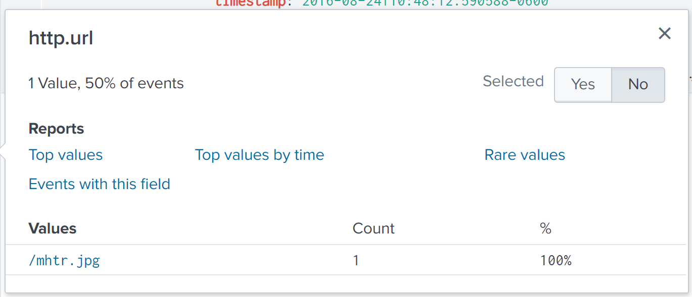

# Splunk BOTS v1 Recap

## Scenario 101: Web Site Defacement

### Q1: What is the likely IPv4 address of someone from the Po1s0n1vy group scanning imreallynotbatman.com for web application vulnerabilities?

First, we need to identify the IP address that belongs to our web server, which is likely what the threat group is scanning. We can run the below SPL query with the pipe command to return the destination IP address (`dest_ip`) with the highest hits, which is likely indicative of a web server.

```
index="botsv1" sourcetype="stream:http"
| top dest_ip
```

After running this SPL query, we see that the IP address with the most hits is `192.168.250.70`.


We can double check and confirm that this is in fact the IP address that belongs to `imreallynotbatman.com` by adding the IP address into the query, and then checking what data it is most commonly associated with in the `site` field. We'll see that it is most commonly associated to `imreallynotbatman.com`.

```
index="botsv1" sourcetype="stream:http" dest_ip="192.168.250.70"
| top site
```


Using this information, we are now interested to know which `src_ip` has the highest hits to `192.168.250.70`, which may be indicative of web scanning and thus our threat actor. We can run the below SPL query and pipe in the top `src_ip` command, which will reveal `40.80.148.42` as the top count (substantially more than the others).

```
index="botsv1" sourcetype="stream:http" dest_ip="192.168.250.70" 
| top src_ip
```


With this piece of information, we can run the below SPL query and see what interesting information we can find in the results. Notably, some of the results contain a `src_headers` field which mention "Acunetix Web Vulnerability Scanner - Free Edition" - this confirms that the IP address `40.80.148.42` is conducting web vulnerability scanning and belongs to the threat actor.


```
index="botsv1" sourcetype="stream:http" dest_ip="192.168.250.70" src_ip="40.80.148.42"
```


#### Answer: 40.80.148.42 

### Q102: What company created the web vulnerability scanner used by Po1s0n1vy?

Based on the information we found in the `src_header` field that is associated to the IP address (40.80.148.42) of the threat actor, the company that created the web vulnerability scanner being used is **Acunetix**.

See Q101 Solution.

#### Answer: Acunetix


### Q103: What content management system is imreallynotbatman.com likely using?

We can filter some of the results from Q1's SPL query by narrowing in on successful HTTP GET requests (status code 200) and see if we find anything interesting that may indicate the CMS. Using the below query, "Joomla" is mentioned several times in the same string as content management. An external search of Joomla indicate that it is a CMS. 


```
index="botsv1" sourcetype="stream:http" dest_ip="192.168.250.70" src_ip="40.80.148.42" status=200
```


#### Answer: Joomla


### Q104: What is the name of the file that defaced the imreallynotbatman.com website? Please submit only the name of the file with extension?

If we assume our server downloaded the malicious file, then we know that our server can be considered the source IP address. We also know that downloads utilize the HTTP GET method. We can build the below SPL query and see if we find anything interesting.

```
index="botsv1" sourcetype="stream:http" src_ip="192.168.250.70" http_method=GET
```

Glancing at the results, we see that some hits contain a `request` field referencing the HTTP GET method used for a file named `poisonivy-is-coming-for-you-batman.jpeg`, which is likely the the file that defaced the `imreallynotbadman.com` website.


#### Answer: poisonivy-is-coming-for-you-batman.jpeg


### Q105: This attack used dynamic DNS to resolve to the malicious IP. What fully qualified domain name (FQDN) is associated with this attack?

When using Q4's SPL query, other interesting values are observed in the results. Notably, the `site` field associated with the HTTP GET method referencing `poisonivy-is-coming-for-you-batman.jpeg` has the value pointing to `prankglassinebracket.jumpingcrab.com`. This is likely the fully qualified domain that is resolved from the malicious IP address.

See solution to Q104.


#### Answer: prankglassinebracket.jumpingcrab.com


### Q106: What IPv4 address has Po1s0n1vy tied to domains that are pre-staged to attack Wayne Enterprises?

So far up to this point we've identified two malicious IP addresses. `40.80.148.42` has been associated to web vulnerability scanning and `23.22.63.114` has been associated to malicious files hosted on a domain. Based on this and if we had to pick one, it is likely `23.22.63.114`.

#### Answer: 23.22.63.114


### Q108: What IPv4 address is likely attempting a brute force password attack against imreallynotbatman.com?

We know that login-related events use the HTTP GET method, so we can build our SPL query to also include `http_method=POST` to narrow our data in the sourcetype `stream:http` and for our IP address `192.168.250.70`. We can also assume that the brute force password attack is likely generating several hits coming from one singular IP address (assuming that only 1 IP address is involved).Login event data may be logged under the `form_data` field. 

Knowing this, we can build the below SPL query to return to us a table that shows us the `form_data` values, the `uri` values (which can provide context on the page the HTTP GET method was used on and may come in handy later), and the event's associaed `src_ip`.

```
index=botsv1 sourcetype=stream:http dest_ip="192.168.250.70" http_method=POST 
| stats count by src_ip, form_data, uri
```

Our table shows us that there are several results tied to the source IP address `23.22.63.114` which seems to be attempting multiple login attempts with the username "admin" and various passwords at the `uri` field value of `/joomla/administrator/index.php`. What this tells us is that the threat actor is conducting a brute force password attack on a administrator page from the source IP address of `23.22.63.114`.


#### Answer: 23.22.63.114


### Q109: What is the name of the executable uploaded by Po1s0n1vy?

For this question, we'll need to change our sourcetype to `fgt_utm`. We know that the threat actor's IP address is `40.80.148.42` and we are looking for some sort of executable file. Based on what we know, we can build the below SPL query and include a wildcard * for .exe (a common executable file extension).

```
index="botsv1" sourcetype="fgt_utm" srcip="40.80.148.42" *.exe
```

Our results will show us that there is a field named `filename` with the value `3791.exe` that is associated with the source IP address that belongs to the threat actor. Clicking on the `filename` field to expand it shows that `3739.exe` is the only executable file, so this is likely the file that was uploaded by the theat actor.


#### Answer: 3791.exe


### Q110: What is the MD5 hash of the executable uploaded?

Now that we know the malicious file name, we can update our SPL query to narrow in on `3791.exe`. In the results, we notice an interesting field called `file_hash`. Viewing the details for this field reveals that value of `ec78c938d8453739ca2a370b9c275971ec46caf6e479de2b2d04e97cc47fa45d`.


We might be tempted to think that this is the correct answer but this string contains 64 characters. We know md5 hash strings contain only 32 characters, so this cannot be our correct answer.

We can try to find the malicious executable file in a different `sourcetype` like `xmlwineventlog:microsoft-windows-sysmon/operational` (Windows Sysmon) as it is plausible that the file may have been executed/opened by command line and it is common to record hashes of all files executed. We can use the below SPL query and see if we can find anything interesting.

```
index="botsv1" sourcetype="xmlwineventlog:microsoft-windows-sysmon/operational" "3791.exe"
```


We can (if it hasn't already) filter in and select a field called `CommandLine` and see that there is a value that matches our malicious file (`3791.exe`). When we tag on `"CommandLine="3791.exe"` to our query to further hone on, we get 1 result that has the `MD5` field with the value of `AAE3F5A29935E6ABCC2C2754D12A9AF0`.


#### Answer: AAE3F5A29935E6ABCC2C2754D12A9AF0


## Q111: GCPD reported that common TTPs (Tactics, Techniques, Procedures) for the Po1s0n1vy APT group, if initial compromise fails, is to send a spear phishing email with custom malware attached to their intended target. This malware is usually connected to Po1s0n1vys initial attack infrastructure. Using research techniques, provide the SHA256 hash of this malware.

We can search the malicious IP address `23.22.63.114` in VirusTotal and see if there are any other files associated to the threat actor's domain. When viewing and expanding on the details for the file called `MirandaTateScreensaver.scr.exe`, we can see it has a SHA256 hash value of `9709473ab351387aab9e816eff3910b9f28a7a70202e250ed46dba8f820f34a8`


#### Answer: 9709473ab351387aab9e816eff3910b9f28a7a70202e250ed46dba8f820f34a8


### Q112: What special hex code is associated with the customized malware discussed in question 11?

Splunk BOTSv1 provides a hint that we'll need to do further external research somewhere on VirusTotal to identify the associated hex code. Wthin the Community Tab, we see the hex value of `53 74 65 76 65 20 42 72 61 6e 74 27 73 20 42 65 61 72 64 20 69 73 20 61 20 70 6f 77 65 72 66 75 6c 20 74 68 69 6e 67 2e 20 46 69 6e 64 20 74 68 69 73 20 6d 65 73 73 61 67 65 20 61 6e 64 20 61 73 6b 20 68 69 6d 20 74 6f 20 62 75 79 20 79 6f 75 20 61 20 62 65 65 72 21 21 21`


#### Answer: 53 74 65 76 65 20 42 72 61 6e 74 27 73 20 42 65 61 72 64 20 69 73 20 61 20 70 6f 77 65 72 66 75 6c 20 74 68 69 6e 67 2e 20 46 69 6e 64 20 74 68 69 73 20 6d 65 73 73 61 67 65 20 61 6e 64 20 61 73 6b 20 68 69 6d 20 74 6f 20 62 75 79 20 79 6f 75 20 61 20 62 65 65 72 21 21 21


### Q114: What was the first brute force password used?

To build out this SPL query, we'll use the SPL query from Q8 but now tag on `src_ip="23.22.63.114"` and `uri=/joomla/Administrator/index.php` to further hone in on the brute force attack.

We'll also want to return a table that sorts the time from earliest to oldest and associates the string used for the brute force attack to the malicious IP address. Using the format of the values found inside of the `form_data` field, we can use RegEx to extract the string the threat actor used for the passwords. Using the SPL query below, we see that the first string used for the bruteforce password attack is `12345678`.

```
index=botsv1 sourcetype=stream:http dest_ip="192.168.250.70" src_ip="23.22.63.114" http_method=POST uri=/joomla/Administrator/index.php
| rex field=form_data "passwd=(?<string>\w+)"
| sort _time
| table  _time src_ip string
```


#### Answer: 12345678


### Q115: One of the passwords in the brute force attack is James Brodsky's favorite Coldplay song. We are looking for a six character word on this one. Which is it?

There are multiple ways to approach this. One way would be to locate a list of all Coldplay songs (from Wikipedia, etc) and paste them into a column (e.g. column A) within Microsoft Excel. You can then use the function `=IF(LEN(A:A) = 6, "Contains 6 characters", "Does not contain 6 characters")
` in the adjacent column (e.g. column B) and let Excel determine which cells have six characters. You can then filter only for rows indicated as having six characters.

From the filtered results, we may notice that some songs (`J-Hope`, `U.F.O.`) were considered to have six characters even though they consisted of special characters. Technically, they do contain six characters it seems the threat actor did not utilize any special characters in their brute force password attack so we will exclude `J-Hope` and `U.F.O.`.

What we're left with are `Aliens`, `Broken`, `Church`, `Clocks`, `Murder`, `Ocean`, `Shiver`, `Sparks`, `Wizkid`, and `Yellow`.


Taking note of the 10 Coldplay song titles with six characters (excluding special characters), we can modify our previous SPL query from Q14. Using RegEx, we'll want to identify any case-insensitive strings submitted as a password that are six characters in length. We'll take those RegEx matches and then search/compare them in a list that we'll populate with the aforementioned 10 Coldplay song titles and display the results in a table.

After running the below query, we see that there is a match to `yellow`.

```
index=botsv1 sourcetype=stream:http dest_ip="192.168.250.70" src_ip="23.22.63.114" http_method=POST uri=/joomla/Administrator/index.php
| rex field=form_data "(?i)passwd=(?<string>[a-zA-Z]{6})"
| search string IN (Aliens, Broken, Church, Clocks, Murder, Oceans, Shiver, Sparks, Wizkid, Yellow)
| table src_ip string
```


#### Answer: yellow


### Q116: What was the correct password for admin access to the content management system running "imreallynotbatman.com"?

Let's think about this one carefully. We know that the threat actor completed a brute force password attack, of which there is a possibility that all but one string worked. The one string that works may stand out to us when viewing log data in that it may have been used the most frequent in comparison to other strings which may have only been used once as part of the brute force. We wouldn't expect to see multiple counts of the same failed string (unless the threat actor conducted multiple brute force password attacks that utilized overlapping strings, but we'd be able to deduce that).

We can use the below SPL query to sort by the strings attempted by frequency and see if theres any that has been uniquely used more frequently than others. We'll also omit the malicious IP address from our query for now as we may want to account that the correct password is used by others (e.g. authorized users).

```
index=botsv1 sourcetype=stream:http dest_ip="192.168.250.70" http_method=POST uri=/joomla/Administrator/index.php
| rex field=form_data "passwd=(?<string>\w+)"
| stats count by string
| sort - count
| table string, count
```


We can see from the results that all strings but one have a count of 1, while `batman` has a count of 2. Based on these results, `batman` appears to be the correct password.

#### Answer: batman


### Q117: What was the average password length used in the password brute forcing attempt? (Round to the closest whole integer)

We can modify the SPL query from Q14 and utilize the `eval` and `stats` function to determine the average lengnth. Using the below query, we see that the average string length for the brute force password attack rounded to the closest whole integer is 6.


#### Answer: 6


### Q118: How many seconds elapsed between the time the brute force password scan identified the correct password and the compromised login? (Round to 2 decimal places)

We know that `batman` appears to be the correct password and that it was utilized twice - once during the brute force attempt and subsuqently once more as the potential compromised login. We can build the below SPL query to return results for only these two events and then apply the `transaction` and `table` function to calculate the elapsed time and present as a table. Using the SPL query below, 92.17 seconds elapsed.

```
index=botsv1 sourcetype=stream:http dest_ip="192.168.250.70" http_method=POST form_data=*passwd*batman*
| rex field=form_data "passwd=(?<string>\w+)"
| transaction string
| table duration
```


#### Answer: 92.17


### Q119: How many unique passwords were attempted in the brute force attempt?

Using the SPL query from Q14, we can see that there were 412 events/statistic results - one for each unique attempted string during the brute force password attack.

See solution to Q114.

#### Answer: 412


## Scenario 2: Ransomware


### Q200: What was the most likely IPv4 address of we8105desk on 24AUG2016?

There are multiple sourcetypes that could help identify the IP address of our `we8105desk` host machine - let's try Windows Sysmon. We can build the below SPL query to search through the Windows Sysmon logs and specify the host machine to be `we8105desk`. Once the results are displayed, we can take a closer look at the `src_ip` field and see what comes up.

```
index=botsv1 sourcetype="XmlWinEventLog:Microsoft-Windows-Sysmon/Operational" host=we8105desk
```


We see that there are 8 different values, all of which are displayed. Let's see if we can rule any of these out using conventional IT knowledge and concepts. Right away, we know that `c0a8:fa64:0:0:9820:26fc:1e0:ffff` and `fe80:0:0:0:9dac:222e:c1f8:d3d8` appear to be MAC addresses based on the format, so that can't the IP address we're looking for. `224.0.0.252` and `239.255.255.250` appear to be within the range that are typically reserved for multicast, so that can't be the host machine we are looking for either. `127.0.0.1` is a special purpose address known as a loopback address, so that is also wrong. `0.0.0.0` is not a typical local host machine IP address, so this is likely wrong as well. `192.168.250.255` is likely being used as a broadcast address on the subnet as indicated by it's 255 as the last octet, so this is also likely not our host machine either.

This leaves `192.168.250.100` as the likely IP address of the host machine were are looking for, as it is the only one that fits the common IPv4 convention for an internal local machine, and also represents 99% of the results.


#### Answer: 192.168.250.100


### Q201: Amongst the Suricata signatures that detected the Cerber malware, which one alerted the fewest number of times? Submit ONLY the signature ID value as the answer. (No puinctuation, just 7 digits)

For this question, we'll need to set our sourcetype to `suricata`. We can build the below SPL query to search for any results mentioning cerber. We can then pipe the stats and count by commands to display `signature`, `alert.signature_id` and `count` fields in a table. When running the below SPL query, we can see that all signatures correctly reference the Cerber malware and `2816763` appears to be the signature ID that alerted the fewest number of times.

```
index=botsv1 sourcetype=suricata cerber
| stats count by signature, alert.signature_id
```


#### Answer: 2816763


### Q202: What fully qualified domain name (FQDN) does the Cerber ransomware attempt to direct the user to at the end of its encryption phase?

We can examine FQDN and DNS querying information in the sourcetype `stream:dns`. We can build a SPL query that limits the source IP to the source IP `192.168.250.100`, but there's going to be a lot of legitimate DNS queries. We can modify the SPL query in an attempt to exclude what we know are likely legitimate queries and see if there is anything unusual leftover.

```
index=botsv1 sourcetype="stream:dns" src_ip="192.168.250.100" NOT query=*.arpa AND NOT query=*.microsoft.com AND NOT query=*.msn.com AND NOT query=*.info AND NOT query=*.local AND NOT queries=*.windows.com AND queries=*.*
| table _time, src_ip, dest_ip, queries
```


With the exclusion of most legitimate queries, we're left with only 83 results where we can see right away that there is a value that references cerber (`cerberhhyed5frqa.xmfir0.win`), which is likely the FQDN the Cerber ransomware is trying to direct the user to.

Alternatively, we could have tried a simplier SPL query and having the `queries` field reference cerber with wildcards to see if anything interesting is returned. Of course, if the FQDN does not have "cerber" in it, there would be no results.

```
index=botsv1 sourcetype="stream:dns" src_ip="192.168.250.100" queries=*cerber*
| table _time, src_ip, dest_ip, queries
```


#### Answer: cerberhhyed5frqa.xmfir0.win


### Q203: What was the first suspicious domain visited by we8105desk on 24AUG2016?

See solution to Q202. Based on the table results and timestamp, the first unusual domain visited by we8015desk on 08/24/2016 appears to be `solidaritedeproximite.org`.

#### Answer: solidaritedeproximite.org


### Q204: During the initial Cerber infection a VB script is run. The entire script from this execution, pre-pended by the name of the launching .exe, can be found in a field in Splunk. What is the length of the value of this field?

Although the question doesn't explictly state to search in context of the host machine we8105desk, we can assume that the .vbs script ran from host=we8105desk as it seems to have been the initial machine infected.

We can search within the Windows Sysmon sourcetype for any .vbs files with a wildcard * and use the `table` command on the `CommandLine` field with the below SPL query. From the results, right away there are a couple unusual results, but the one that stands out the most starts with `cmd.exe`, contains a lot of characters, and almost appears to be obfuscated - let's focus on this one.

```
index=botsv1 sourcetype="XmlWinEventLog:Microsoft-Windows-Sysmon/Operational" host=we8105desk *.vbs
| table _time, CommandLine
```


To determine the character length, we can modify our SPL query to pipe in the `eval` command and apply a `len` function to the `CommandLine` field. After running the modified SPL query below, we see that the character length is 4490.

```
index=botsv1 sourcetype="XmlWinEventLog:Microsoft-Windows-Sysmon/Operational" host=we8105desk *.vbs
| eval cmdlength=len(CommandLine)
| table _time, CommandLine, cmdlength
```


#### Answer: 4490


### Q205: What is the name of the USB key inserted by Bob Smith?

USB information can be found within the sourcetype `winregistry`. Windows stores the USB device name as data within the registry name `friendlyname`. Knowing this, we can build the SPL query below and see if we find anything interesting.

```
index=botsv1 sourcetype=winregistry host=we8105desk friendlyname
```


If we view the values for the field `registry_value_data`, we see that there's 2 counts for `MIRANDA_PRI`. This is likely the name of the USB device. Additionally, per BOTSv1 synposis, Bob found a USB drive in the parking lot, plugged it into his desktop, and opened a word document in the USB drive called "Miranda_Tate_unveiled.dotm".

#### Answer: MIRANDA_PRI


### Q206: Bob Smith's workstation (we8105desk) was connected to a file server during the ransomware outbreak. What is the IPv4 address of the file server?

First, we know that there could be many types of "file server" - SMB, FTP, etc. Let's first run a more generic SPL query below to see what interesting sourcetypes Bob's workstation is identified as the source IP address.

```
index=botsv1 src_ip="192.168.250.100"
```


Interestingly, we see `stream:smb` which may the SMB file server Bob's machine is connected to. If we were to add this sourcetype to our SPL query and present the results as a table showcasing the `dest_ip` field, we'll see that there's really only one IP address that Bob's machine connected to - `192.168.250.20`. This is likely the IP address of the SMB file server.

```
index=botsv1 sourcetype="stream:smb" src_ip="192.168.250.100"
| stats count by src_ip, dest_ip
```


#### Answer: 192.168.250.20


### Q207: How many distinct PDFs did the ransomware encrypt on the remote file server?

First, we should figure out the name of the SMB file server in question that is hosting the pdf files. One way to approach this is to run a really broad SPL query to return all pdf files and see if we find anything interesting in the `host` field. When we run the below query, we see that there are only 3 host machines. We know it can't be `splunk-02` or Bob's machine (`we8105desk`), so that means it has to be `we9041srv`. Did you notice the naming convention? Bob's machine ended in "desk" for desktop, while this one ends in "srv" which is likely for server.

Now that we know the host name, we can modify our SPL query to further hone in on the SMB remote server. 

```
index=botsv1 host=we9041srv *.pdf
```


Based on the results, it looks like the field `Relative Target Name` contains each pdf file name, so we can build the SPL query below to distincity count the `Relative Target Name` field. Running the SPL query below shows us that there were 258 distinct values for the `Relative Target Name` field.

```
index=botsv1 sourcetype="WinEventLog:Security" host=we9041srv *.pdf Source_Address="192.168.250.100"
| stats dc(Relative_Target_Name) as totalcount
```


#### Answer: 257 (?)


### Q208: The VBscript found in question 204 launches 121214.tmp. What is the ParentProcessId of this initial launch?

We can modify the SPL query from Q204 now that we know that we're specifically looking for 121214.tmp. Running the modified below SPL query will return to us the Parent Process ID in a table.

```
index=botsv1 sourcetype="XmlWinEventLog:Microsoft-Windows-Sysmon/Operational" host=we8105desk CommandLine="\"C:\\Windows\\System32\\cmd.exe\" /C START \"\" \"C:\\Users\\bob.smith.WAYNECORPINC\\AppData\\Roaming\\121214.tmp\""
| table ParentProcessId
```


#### Answer: 3968


### Q209: The Cerber ransomware encrypts files located in Bob Smith's Windows profile. How many .txt files does it encrypt?

To figure this out, we'll need to pivot back to the Windows Sysmon sourcetype and understand what the file directory paths looks like for Bob's machine. When we run the below SPL query, we can view the `Image` field and see if there's anything that would suggest what Bob's file directory paths looks like.

```
index=botsv1 sourcetype="XmlWinEventLog:Microsoft-Windows-Sysmon/Operational" host=we8105desk
```


Right away, the top value is of interest to us as it appears to give a hint as to what Bob's file directory paths look like. We'll want to locate all .txt files within Bob's machines, and we can represent this with `TargetFilename="C:\\Users\\bob.smith.WAYNECORPINC\\*\\*.txt`" in our SPL query. Notice the wildcard * placed to represent any subdirectories and any filename preceding the .txt extension. Further, we'll pipe in `| stats dc(TargetFilename)` to count the unique matches (each unique file) and display the result as a table.


```
index=botsv1 sourcetype="XmlWinEventLog:Microsoft-Windows-Sysmon/Operational" host=we8105desk TargetFilename="C:\\Users\\bob.smith.WAYNECORPINC*\\*.txt"
| stats dc(TargetFilename)
```


#### Answer: 406


### Q210: The malware downloads a file that contains the Cerber ransomware cryptor code. What is the name of that file?

For this question we'll pivot back to `suricata` for sourcetype. We know that the first unusual domain accessed was `solidaritedeproximite.org` at the time of the ransomware outbreak. We can build the SPL query below and see if there's anything interesting in the `http:url` field. 

```
index=botsv1 sourcetype=suricata src_ip="192.168.250.100" solidaritedeproximite.org
```




We see that there's one file called `mhtr.jpg`. Seeing that it's associated with the unusual domain, this is likely the file containing the ransomware cryptor code.


#### Answer: mhtr.jpg


### Q211: Now that you know the name of the ransomware's encryptor file, what obfuscation technique does it likely use?

Something to consider is that we were able to see within Splunk logs that the file extension is jpg. While file extension spoofing (disguising one file extension type as another, e.g. ".exe" as ".jpg") could be a common obfuscation technique utilized by threat actors, this doesn't seem to be the case here.

The obfuscation technique that the threat actor appeared to use is `steganography`, the practice of concealing additional information, data, and/or code (known as "payload") within another file (called a "carrier file", "container"). Carrier files and containers can range from jpg, mp3, mp4, and even pdf.


#### Answer: Steganography


