# Splunk BOTS v2 Recap

This Splunk BOTS recap and walkthrough is based on the Version 2 (2017) event. You can download the botsv2 dataset from https://github.com/splunk/botsv2 and load into a Splunk instance, or you can sign up for an account at https://tryhackme.com and play along.


## Table of Contents

* 100 Series Questions

    * Q100-1: Amber Turing was hoping for Frothly to be acquired by a potential competitor which fell through, but visited their website to find contact information for their executive team. What is the website domain that she visited?

    * Q100-2: Amber found the executive contact information and sent him an email. What image file displayed the executive's contact information? Answer example: /path/image.ext

    * Q100-3: What is the CEO's name? Provide the first and last name.

    * Q100-4: What is the CEO's email address?

    * Q100-5: After the initial contact with the CEO, Amber contacted another employee at this competitor. What is that employee's email address?

    * Q100-6: What is the name of the file attachment that Amber sent to a contact at the competitor?

    * Q100-7: What is Amber's personal email address?


* 200 Series Questions
    * Q200-1: What version of TOR Browser did Amber install to obfuscate her web browsing? Answer guidance: Numeric with one or more delimiter.

    * Q200-2: What is the public IPv4 address of the server running www.brewertalk[.]com?

    * Q200-3: Provide the IP address of the system used to run a web vulnerability scan against www.brewertalk[.]com.

    * Q200-4: The IP address from Q#2 is also being used by a likely different piece of software to attack a URI path. What is the URI path? Answer guidance: Include the leading forward slash in your answer. Do not include the query string or other parts of the URI. Answer example: /phpinfo.php

    * Q200-5: What SQL function is being abused on the URI path from the previous question?

    * Q200-6: What was the value of the cookie that Kevin's browser transmitted to the malicious URL as part of an XSS attack? Answer guidance: All digits. Not the cookie name or symbols like an equal sign.

    * Q200-7: What was the value of the cookie that Kevin's browser transmitted to the malicious URL as part of an XSS attack? Answer guidance: All digits. Not the cookie name or symbols like an equal sign.


* 300 Series Questions
* 400 Series Questions


## 100 Series Questions

### Q100-1: Amber Turing was hoping for Frothly to be acquired by a potential competitor which fell through, but visited their website to find contact information for their executive team. What is the website domain that she visited?

To see a list of websites Amber visited, we'd need to narrow in on Amber's IP address within the sourcetype `stream:http`. We can identify Amber's IP address by running the SPL command below with Amber's name to see if there are results associated with a particular IP address.

```
index="botsv2" sourcetype="pan:traffic" amber
```

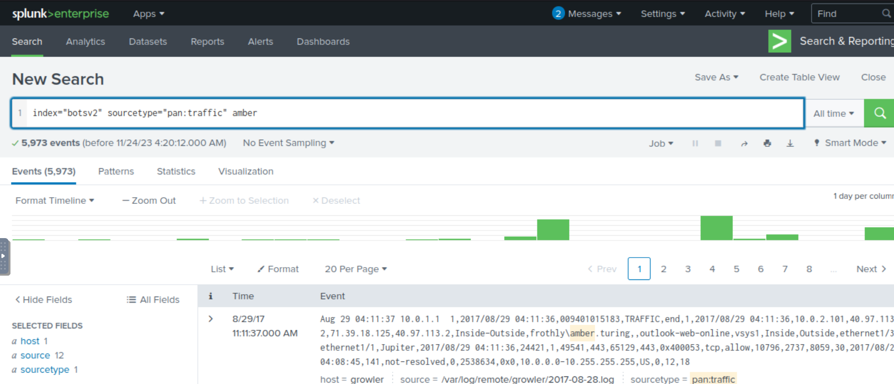


When we examine the `src_ip` field, we notice that there's several hits for one specific value (and no other values observed). Based on this, this is likely the IP address that belongs to Amber.

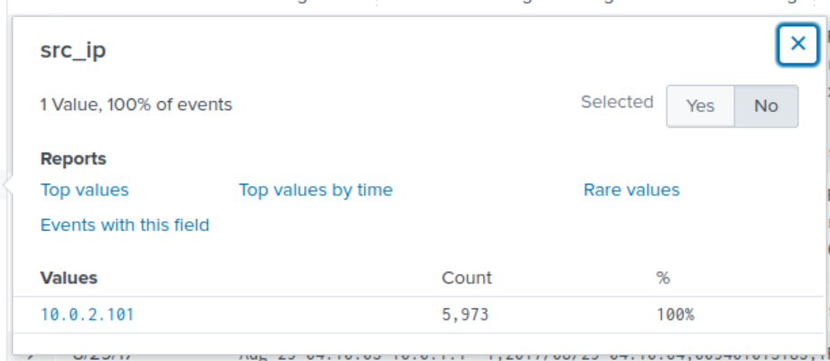

We can now run the below SPL query to put the values of the `site` field in a table. It's important to consider that the same site may have been visited multiple times, thus there are multiple hits/counts. We can omit duplicate values by applying the `dedup` command to the field `site` as well.

```
index="botsv2" sourcetype="stream:http" src_ip:"10.0.2.101"
| table site
| dedup site
```

We are then presented with a table of 107 different values. We know that Amber's company is in the beer/brewing industry, so we could manually sift through the results until we identify a domain name that may be associated to this industry. After manually sifting through the data, we identified the value of `www.berkbeer.com`. Based on the domain name and its possible association to the beer/brewing industry, this is likely the competitor's website.

**Answer: www.berkbeer.com**

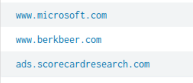


### Q100-2: Amber found the executive contact information and sent him an email. What image file displayed the executive's contact information? Answer example: /path/image.ext

Now that we know what the site is, we can run the below SPL query and take a closer look at the values for the field `url_path`.

```
index="botsv2" sourcetype="stream:http" src_ip="10.0.2.101" site="www.berkbeer.com"
```

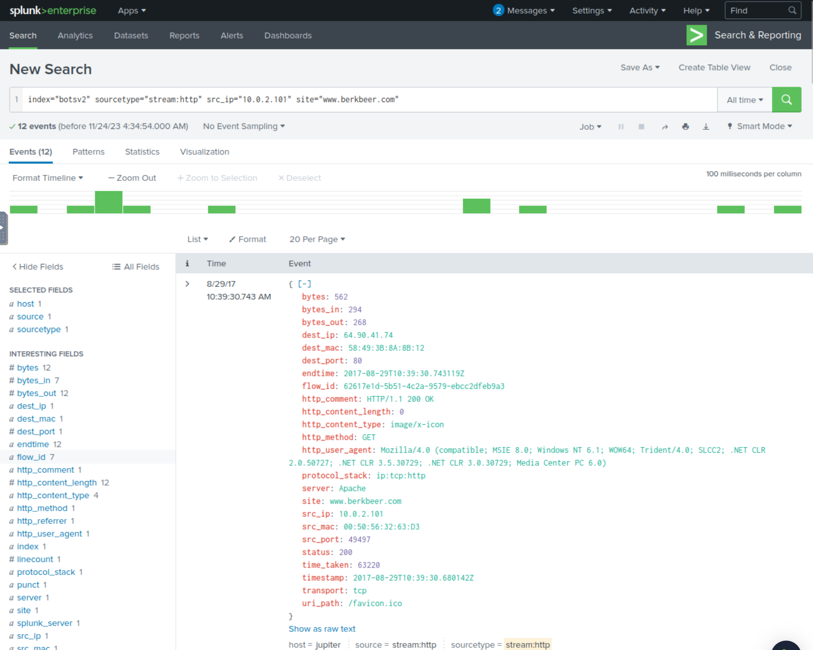

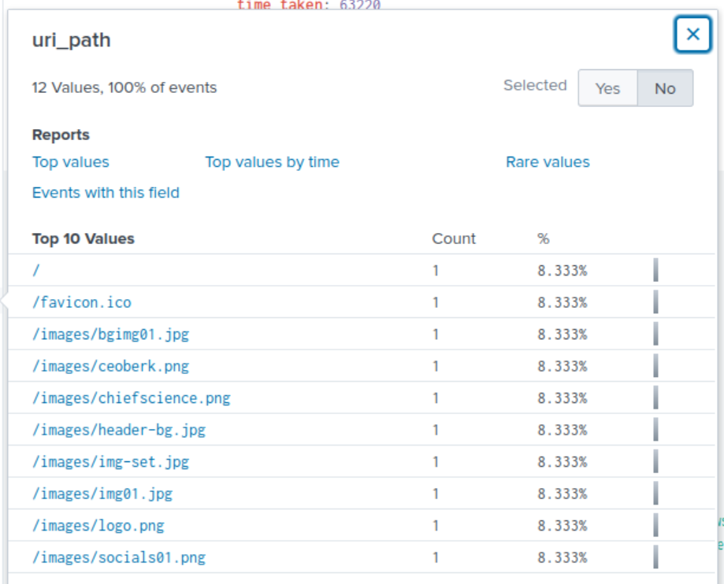

When examining the values for `url_path`, we can keep in mind for any possible path names that reference the CEO or contact information. `/images/ceoberk.png` seems to be the most relevant path name that may suggest being related to the CEO and possibly containing contact information.

**Answer: /images/ceoberk.png**


### Q100-3: What is the CEO's name? Provide the first and last name.

We know that "ceoberk" might hint that berk is part of the name and will keep this in mind. We could determine first and last name information from email traffic/data derived from sourcetype `stream:smtp`. But before anything we'll need to find Amber's email. We can use the below SPL query and see if there are any interesting field/values that might give a clue as to what Amber's email is.

```
index="botsv2" sourcetype="stream:smtp" amber
```

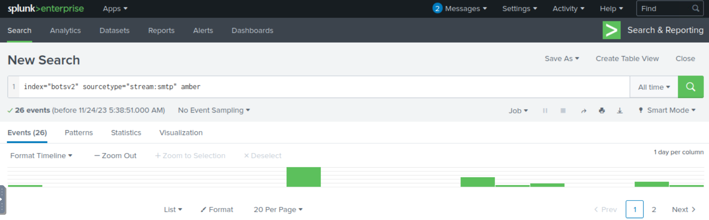

Examining the results show us that the fields `sender`, `sender_alias`, and `sender_email` is of interest to us, and we've identified the email assocaited with Amber (`aturing@froth.ly`).


With this information, we can revise our SPL query to now include Amber's email and toss in the keyword "berk" and see if anything comes up.

```
index="botsv2" sourcetype="stream:smtp" aturing@froth.ly berk
```

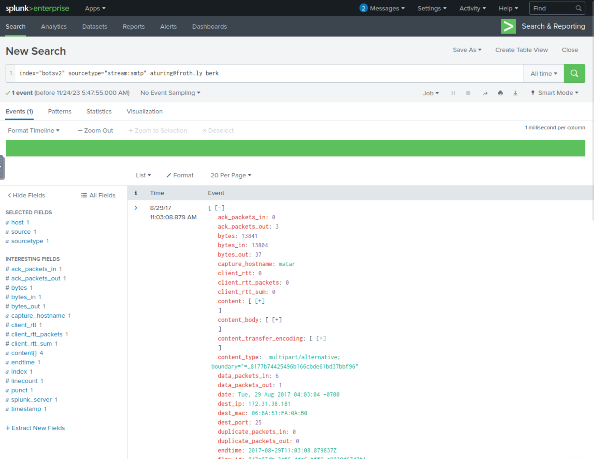

Examining the single result we get back, we can identify the CEO's email, but it doesn't seem to provide the first/last name. At least we know the first name likely starts with an M based on the email naming convention.

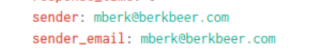

If we try to view as raw data for this result, we can try to see if there's any content in the raw data that would provide the first/last name. We know it probably starts with an M so we can keep that in mind. Ctrl+F `berk` or ctrl+F `mberk@berkbeer.com` and cycling through all the results is likely the best way to sift through the raw data to identify the first/last name within approximate location of the name berk or the email.

After sifting through the raw data, we've identified that the CEO's full name is Martin Berk.

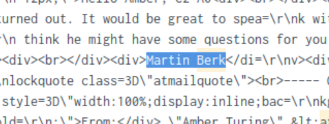

**Answer: Martin Berk**


### Q100-4: What is the CEO's email address?

See solution to Q3.

**Answer: mberk@berkbeer[.]com** 

### Q100-5: After the initial contact with the CEO, Amber contacted another employee at this competitor. What is that employee's email address?

From prior solutions, we learned that Berk Beer is the competitor company and that their email domain is `@berkbeer.com`. Using this information, we can build the below SPL query to search through the sourcetype `stream:smtp` for any events that match Amber's email with the email domain of `@berkbeer`. We know one of the events should be Amber's email with the CEO.

```
index="botsv2" sourcetype="stream:smtp" aturing@froth.ly berk
```


When examining the events, we can see that there is the field `receiver_email` with the value of `hbernhard@berkbeer.com`, which appears to be the employee's email.

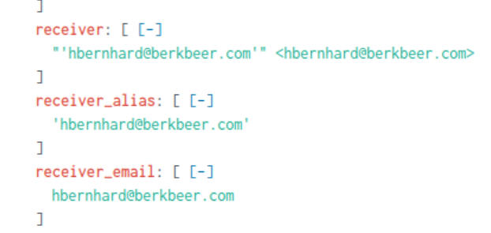

**Answer: hbernhard@berkbeer[.]com**


### Q100-6: After the initial contact with the CEO, Amber contacted another employee at this competitor. What is that employee's email address?

See solution to Q5.

When examining the event data associated to `hbernhard@berkbeer.com`, we see that there is the field `attach_filename` with the value of `Saccharomyces_cerevisiae_patent.docx`, which appears to be the name of the file attachment.

**Answer: Saccharomyces_cerevisiae_patent.docx**


### Q100-7: What is Amber's personal email address?

When reading the raw data or viewing the values for the field `content_body`, we see what appears to be an encoded message. Interestingly enough, if we expand and view the values for the field `content_transfer_encoding`, it has a value of `base64`. Based on this information, we can copy the value from `content_body` and paste it into https://gchq.github.io/CyberChef and use the **From Base64** recipe.

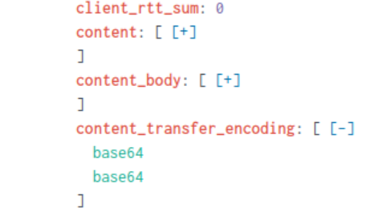

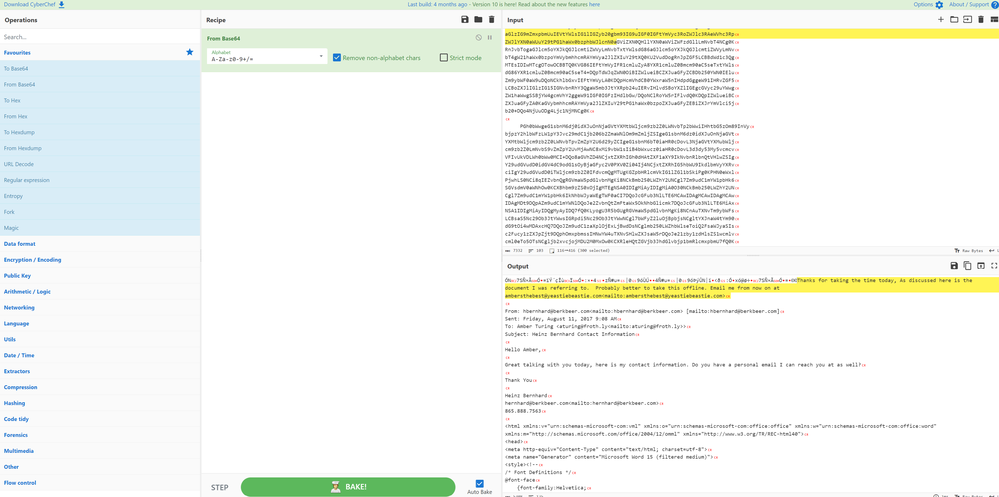

After pasting in the encoded string into the Input box, we can see under the Output box the email conversation thread in cleartext where Amber's personal email is `ambersthebest@yeastiebeastie.com`. Yikes, looks like there's a potential insider threat/risk situation on our hands.

**Answer: ambersthebest@yeastiebeastie[.]com**


## 200 Series Questions

### Q200-1: What version of TOR Browser did Amber install to obfuscate her web browsing? Answer guidance: Numeric with one or more delimiter.

We can build the generic SPL query below to check for events matching both `tor` (the browser application we're interested in) and `amber` (Amber's host machine likely has directories that is inclusive of her name). There are over 300 events that match our query. 

```
index="botsv2" tor amber
```

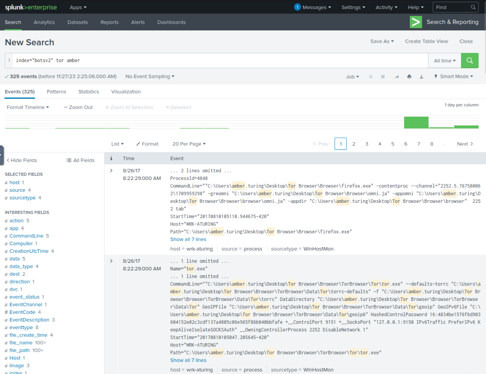

If we examine the Interesting Fields section, we see that there is a field called `Image`. Typically, images may contain information of a specific version/firmware of a particular application. If we expand the field `Image`, we can see that there is a value that references a TOR install as 7.0.4, which is likely the version of the TOR browser Amber installed.


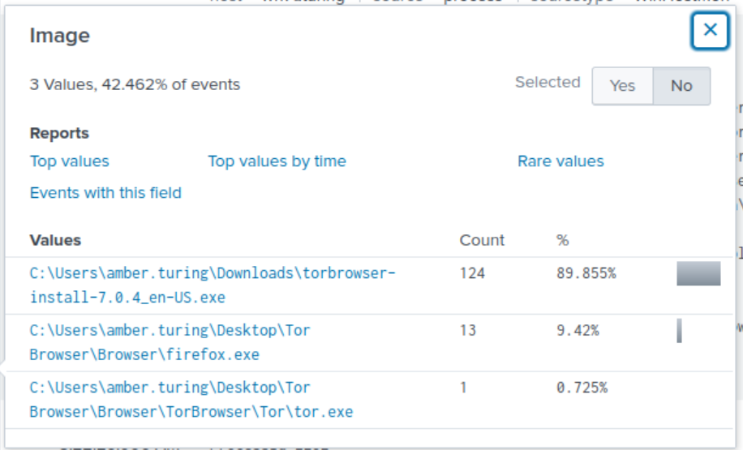

**Answer: 7.0.4**


### Q200-2: What is the public IPv4 address of the server running www.brewertalk[.]com?

We can likely find this information within the sourcetype `stream:http` and build a SPL query that looks for events related to www.brewertalk[.]com and filters for destination ports equal to 80 or 443 (as expected for a web server). Additionally, we'll add in the splunk command `stats count by dest_ip` to see if there is one particular IP address that stands out with a substantial amount of events.

```
index="botsv2" sourcetype="stream:http" www.brewertalk.com (dest_port=80 OR dest_port=443)
| stats count by dest_ip
```

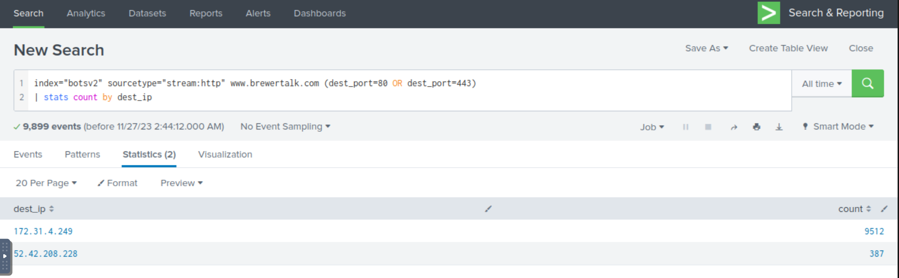

Right away, we see that 172.31.4.249 has a really high count number, but this address is in the private address space so we know this cannot be the answer. The only other address is a public IP address, which is likely the public address of the server running www.brewertalk[.]com.

**Answer: 52.42.208.228**


### Q200-3: Provide the IP address of the system used to run a web vulnerability scan against www.brewertalk.com.

We can can reasonably assume that the IP address conducting the web vulnerability scan will likely have a substantial amount of hits from web crawling, port scanning, etc. We can build the below SPL query and see if there are any IP addresses that stand out.

```
index="botsv2" sourcetype="stream:http" www.brewertalk.com
| top src_ip
```


Right away, we see that the IP address `45.77.65.211` has a substantial amount of hits and represents approximately 90% of source IPs. This is likely the IP address that is conducting web vulnerability scanning activity.

**Answer: 45.77.65.211**


### Q200-4: The IP address from Q#2 is also being used by a likely different piece of software to attack a URI path. What is the URI path?

We can build the below SPL query and include the `top` command applied to the field `uri_path`. We can reasonably assume that that perhaps there may be some sort of fuzzing attack going on or perhaps some sort of injection attack, and so this specific URI path may have a lot of hits/requests coming from this IP address.

```
index="botsv2" sourcetype="stream:http" www.brewertalk.com src_ip="45.77.65.211"
| top uri_path
```

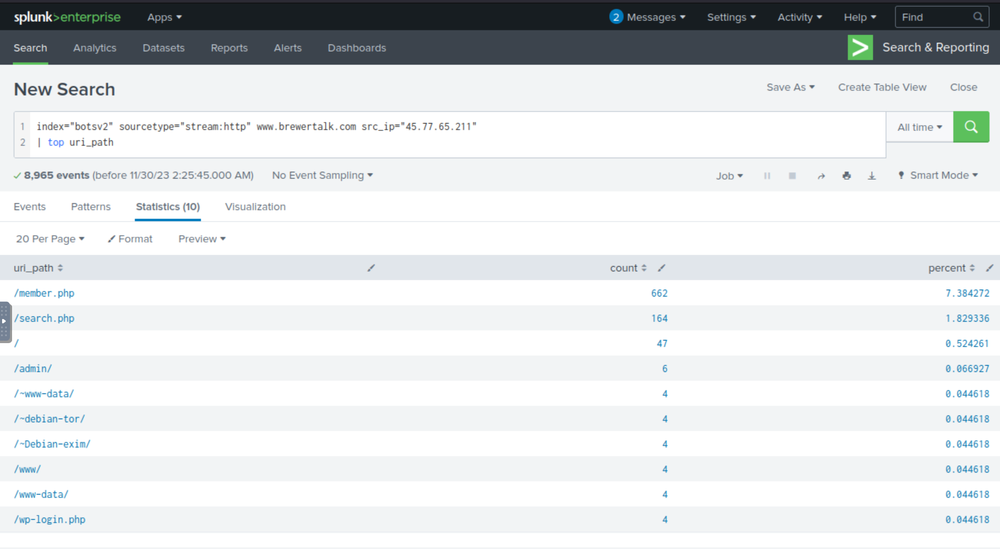


Th `top` command reveals to us the top 10 values with the most counts. We see two paths that catch our eyes: `/member.php` and `/search.php`. However, `/member.php` has a substantially higher count, therefore likely being under attacked in some way.

**Answer: /member.php**


### Q200-5: What SQL function is being abused on the URI path from the previous question?

Now that we know that the URL path of `/member.php` is being attacked, we can build the below SPL query to put into the table the unique values from the `form_data` field, which will likely house the SQL injection string.

```
index="botsv2" sourcetype="stream:http" www.brewertalk.com src_ip="45.77.65.211" uri_path="/member.php"
| table form_data
| dedup form_data
```

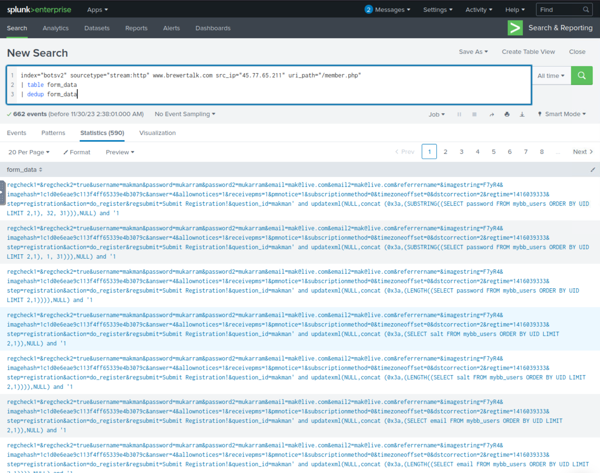

Based on the strings observed, it looks like there is a SQL function of `updatexml`, which is used to modify data within an XML document stored inside of the SQL database.

**Answer: updatexml**

### Q200-6: What was the value of the cookie that Kevin's browser transmitted to the malicious URL as part of an XSS attack? Answer guidance: All digits. Not the cookie name or symbols like an equal sign.

We can build the below query to include the general keywords `www.brewertalk.com` and `kevin` and apply a `table` command to the field `cookie` and see if anything interesting pops up.

```
index="botsv2" sourcetype="stream:http" www.brewertalk.com kevin
| table cookie
```

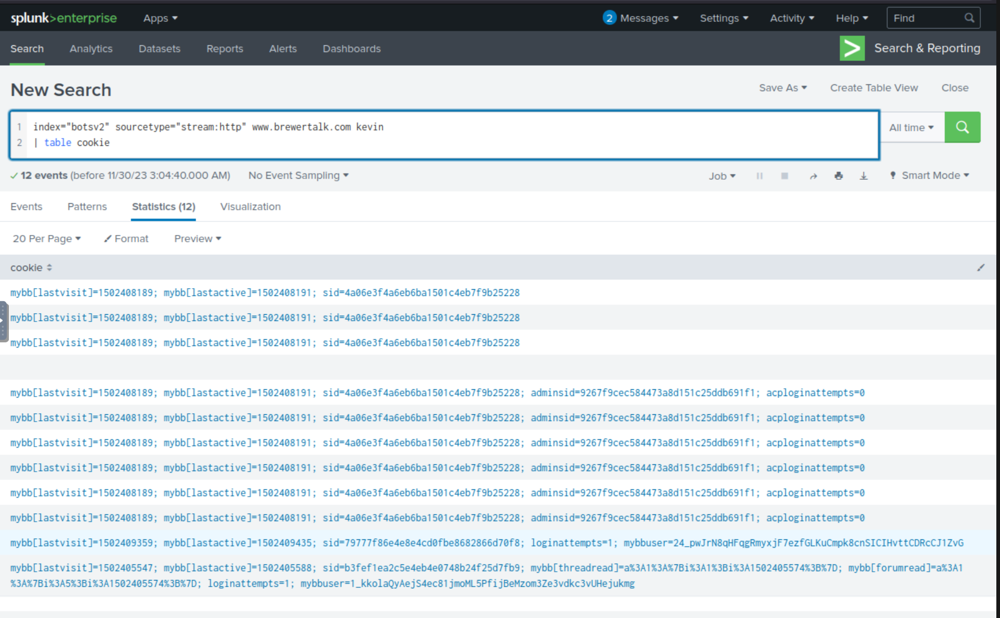


We notice that there seems to be the cookie value of `1502408189` associated with multiple potential login attempts.

**Answer: 1502408189**


### Q200-6: What brewertalk.com username was maliciously created by a spear phishing attack?

We can modify the prior question's SPL query to simply review the `table` command to view events. We'll notice that some of the events have some Javascript strings, which may provide insight into what the brewertalk username was used in these attacks. If we ctrl+f `username`, we can see that there is a username referenced as kIagerfield.

```
index="botsv2" sourcetype="stream:http" www.brewertalk.com kevin
```
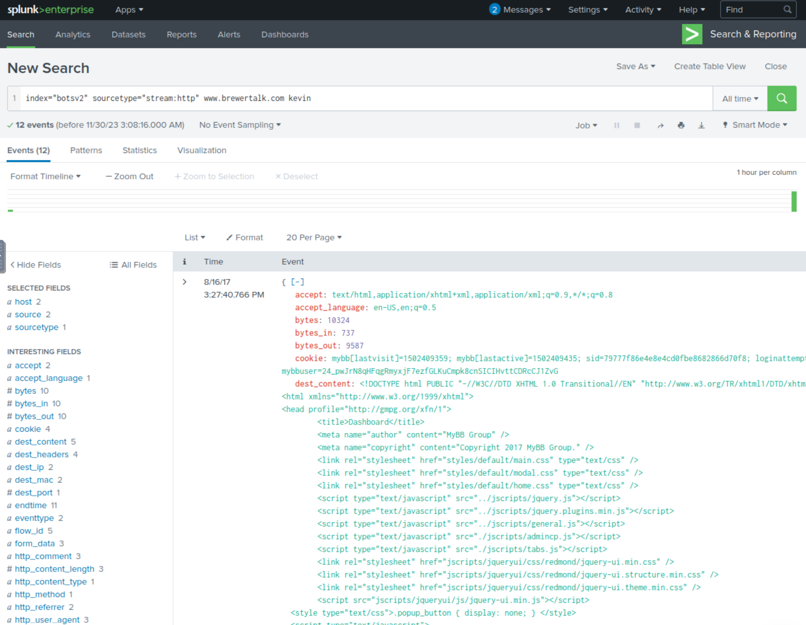


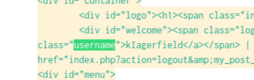

**Answer: kIagerfield**


## 300 Series Questions

### Q300-1: Mallory's critical PowerPoint presentation on her MacBook gets encrypted by ransomware on August 18. What is the name of this file after it was encrypted?

First, let's see if we can identify the Mallory's hostname by running the simple SPL query below and checking the values for the field `host` in a easy to read table.

```
index="botsv2" mallory
| table host
| dedup host
```


The value `MACLORY-AIR13` seems to be Mallory's hostname, a play on "Macbook Air 13" and Mallory. 

The question states that Mallory's PowerPoint presentation was encrypted - so we know that we are searching for files with the possible file extensions of .pptx, .pptm, and/or .ppt. We can put this all together into a SPL query below and see if we find any interesting results around August 18.

```
index="botsv2" host="MACLORY-AIR13" (*.pptx OR *.pptm OR *.ppt)
```
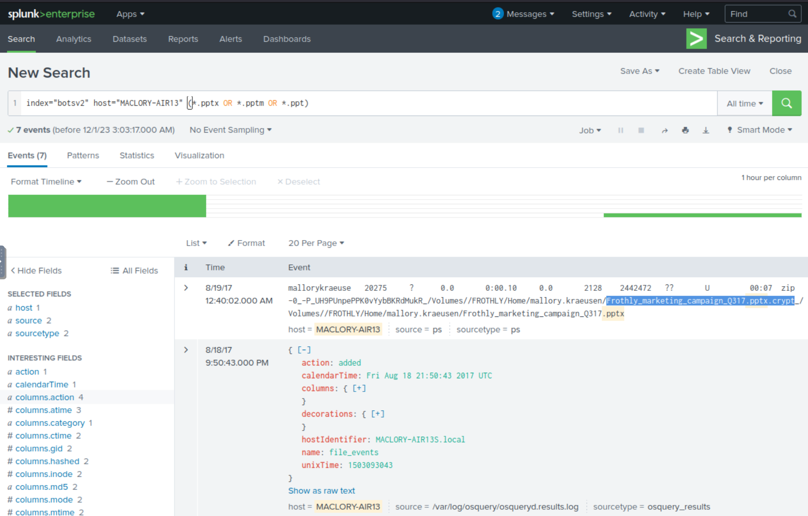

Interestingly, on 08/19/2017 we see that there's a file called `Frothly_marketing_campaign_Q317.pptx.crypt`, which is likely the name of Mallory's PowerPoint file after it became encrypted.

**Answer: Frothly_marketing_campaign_Q317.pptx.crypt**


### Q300-2: There is a Games of Thrones movie file that was encrypted as well. What season and episode is it? 

This should be a relatively straightforward query. We know that the Game of Thrones movie file is on Mallory's host machine and that the encrypted files have a `.crypt` file extension. We can reasonably assume that the file name probably contains some variation of the string "GOT" or "Game of Thrones". Adding `(GOT OR *Thrones)` should capture most of the possible naming conventions one can expect for this Game of Thrones file.

```
index="botsv2" host="MACLORY-AIR13" *.crypt (GOT OR *Thrones")
```

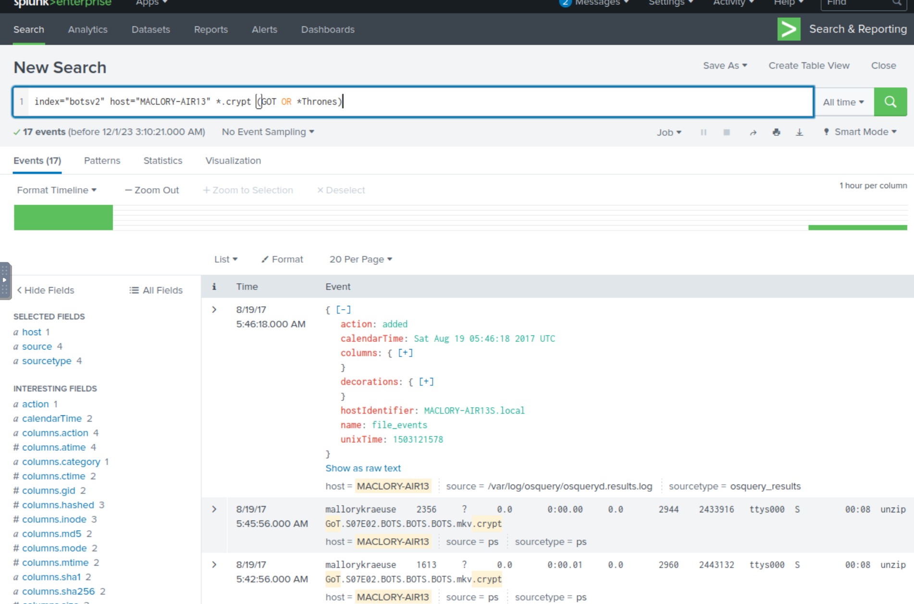

When viewing the events, we see that there is a file named "GoT.S07E02.BOTS.BOTS.BOTS.mkv.crypt". "GOT" stands for Game of Thrones. S07E02 stands for Season 07 Episode 02. .mkv is a movie/video media file extension. .crypt is the file extension we've observed for the encrypted files. This is the movie file that was encrypted.

**Answer: S07E02**


### Q300-3: Kevin Lagerfield used a USB drive to move malware onto kutekitten, Mallory's personal MacBook. She ran the malware, which obfuscates itself during execution. Provide the vendor name of the USB drive Kevin likely used.

We can try to run the general SPL query below and see if we can find anything interesting or any additional information to help refine our search.

```
index="botsv2" kutekitten usb vendor
```
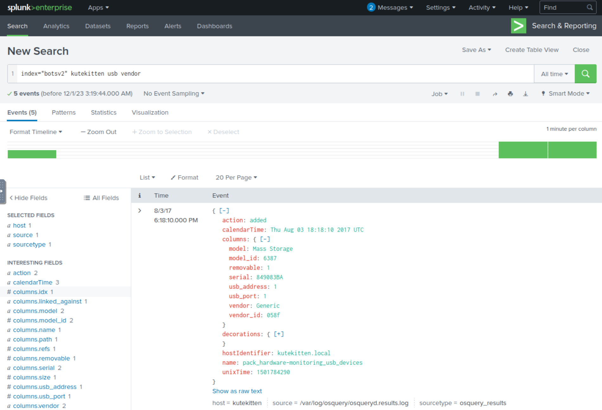

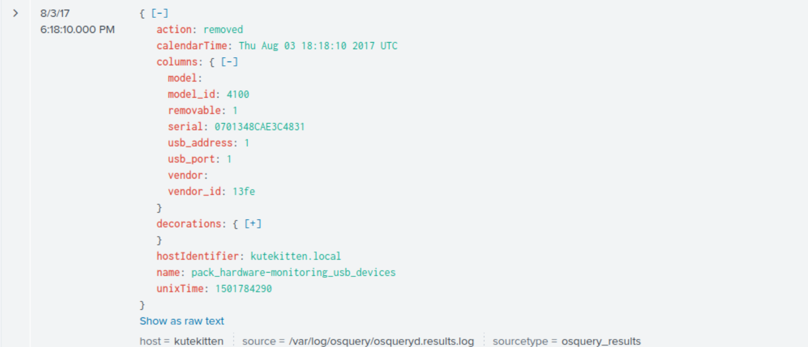

If we expand the `columns` field within our events, we're presented with additional fields; interestingly one is named `vendor_id` and our events show us two distinct values: `058f` and `13fe`. When we search these two vendor IDs up, we get Alcor Micro Corp and Phison Electronics Corp. Based on the answer formatting, the answer is Alcor Micro Corp.


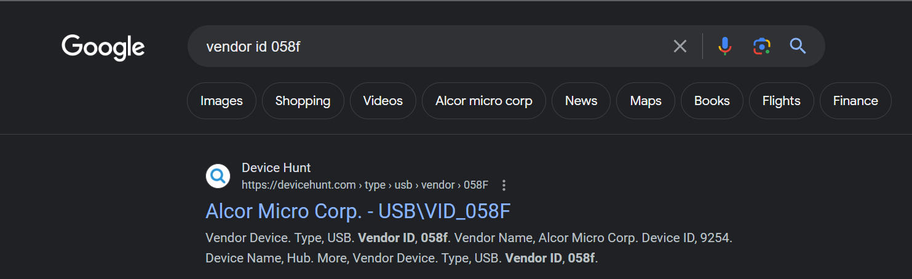

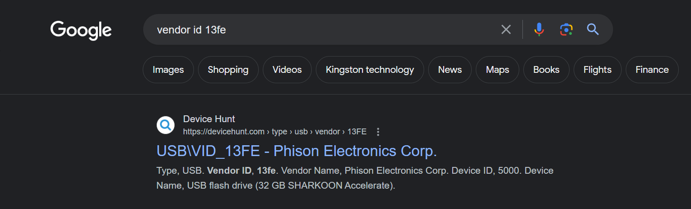

**Answer: Alcor Micro Corp**


### Q300-5:


## 400 Series Questions


